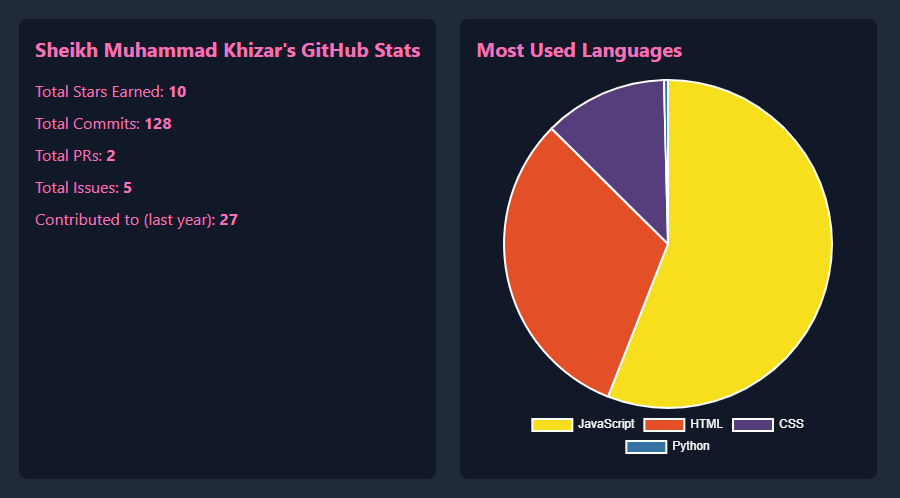

<!-- GitHub Profile README Template -->

<h1 align="left">Welcome to my GitHub Profile!    I'm Sheix Muhammad Khizar, a Professional Software Engineer</h1>

<h3 align="left">About Me</h3>

I am a highly skilled Software Engineer with expertise in designing, developing, and maintaining software systems and Web applications. With a deep understanding of programming concepts and a passion for solving complex problems, I specialize in creating robust, scalable, and user-friendly solutions. My technical proficiency spans across various technologies, making me adaptable and efficient in dynamic environments.

✨ Solving Problems since 2023 📚 Currently learning Node-JS 🎯 Goals: Become a full-stack developer by 2026

<h3 align="left">Skills</h3>

  
  
  
  
  
  
  
  
  
  
  
  
  
  
  
  
  
  
  
  
  
  
  
  

<h3 align="left">Social Links</h3>

  
  
  
  

<h3 align="left">GitHub Stats</h3>

  

 

