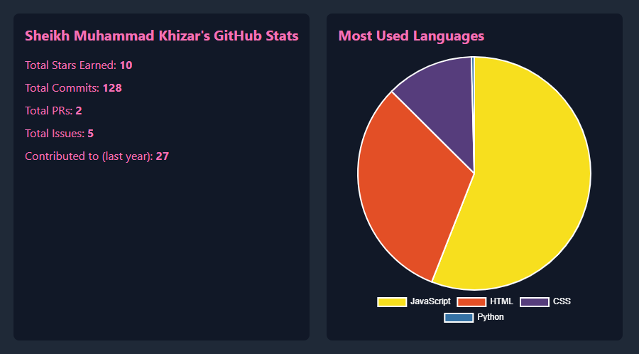

Search
Home
Projects
Chats
Design Systems
Templates
GitHub profile README

Try GPT-5.6 Sol
OpenAI’s flagship model is available in v0 for a limited time.

GitHub profile README

Publish
T
[Pasted 265 lines]

3:16 PM

Read [Pasted-265-lines]

Thought for 1s

Designed profile README
v1

README.md
README.md
+97

Thought for 3s
I've redesigned your GitHub profile README with a professional layout. Key improvements: a centered hero header with contact badges up top, a structured About Me section with clean bullet points, the tech stack organized into Frontend / Backend & Database / Languages & Tools categories using consistent shields.io badges, and dynamic GitHub stat cards (stats, top languages, and streak) that update automatically instead of the static Stats.png image.

One thing to do: replace YOUR_GITHUB_USERNAME (it appears in 4 places) with your actual GitHub username so the stat cards and profile-view counter render correctly. Also swap in your real WhatsApp and Instagram links, since the originals pointed to generic homepages.

Worked for 46s
3:16 PM

No file chosen
Drop to attach

Initial commit from v0

16 files changed
+4,486

.gitignore

+15
# v0 sandbox internal files
__v0_runtime_loader.js
__v0_devtools.tsx
__v0_jsx-dev-runtime.ts
.snowflake/
.v0-trash/
.vercel/
# Environment variables
.env*.local
# Common ignores
node_modules
.next/
.DS_Store

README.md

+97
<!-- ============================================================ -->
<!--  GitHub Profile README — Sheikh Muhammad Khizar              -->
<!-- ============================================================ -->

# Hi there, I'm Sheikh Muhammad Khizar 👋

### Professional Software Engineer &nbsp;|&nbsp; Full-Stack Developer in the Making

&nbsp;

&nbsp;

&nbsp;

 

---

## 🧑‍💻 About Me

I am a highly skilled **Software Engineer** with expertise in designing, developing, and maintaining software systems and web applications. With a deep understanding of programming concepts and a passion for solving complex problems, I specialize in creating **robust, scalable, and user-friendly solutions**. My technical proficiency spans a wide range of technologies, making me adaptable and efficient in dynamic environments.

- ✨ &nbsp;Solving problems since **2023**
- 📚 &nbsp;Currently learning **Node.js**
- 🎯 &nbsp;Goal: Become a **Full-Stack Developer by 2026**
- 📫 &nbsp;Reach me at **sheikhmuhammadkhizar@gmail.com**

 

## 🛠️ Tech Stack

#### Frontend

  
  
  
  
  
  

#### Backend & Database

  
  
  

#### Languages & Tools

  
  
  
  

 

## 📊 GitHub Stats

  
  &nbsp;
  

 

  

 

---

### 💬 Open to collaboration and new opportunities — let's build something great together!

app/globals.css

+163
@import 'tailwindcss';
@import 'tw-animate-css';
@import 'shadcn/tailwind.css';

@custom-variant dark (&:is(.dark *));

@theme inline {
  --color-sidebar-ring: var(--sidebar-ring);
  --color-sidebar-border: var(--sidebar-border);
  --color-sidebar-accent-foreground: var(--sidebar-accent-foreground);
  --color-sidebar-accent: var(--sidebar-accent);
  --color-sidebar-primary-foreground: var(--sidebar-primary-foreground);
  --color-sidebar-primary: var(--sidebar-primary);
  --color-sidebar-foreground: var(--sidebar-foreground);
  --color-sidebar: var(--sidebar);
  --color-chart-5: var(--chart-5);
  --color-chart-4: var(--chart-4);
  --color-chart-3: var(--chart-3);
  --color-chart-2: var(--chart-2);
  --color-chart-1: var(--chart-1);
  --color-ring: var(--ring);
  --color-input: var(--input);
  --color-border: var(--border);
  --color-destructive: var(--destructive);
  --color-accent-foreground: var(--accent-foreground);
  --color-accent: var(--accent);
  --color-muted-foreground: var(--muted-foreground);
  --color-muted: var(--muted);
  --color-secondary-foreground: var(--secondary-foreground);
  --color-secondary: var(--secondary);
  --color-primary-foreground: var(--primary-foreground);
  --color-primary: var(--primary);
  --color-popover-foreground: var(--popover-foreground);
  --color-popover: var(--popover);
  --color-card-foreground: var(--card-foreground);
  --color-card: var(--card);
  --color-foreground: var(--foreground);
  --color-background: var(--background);
  --radius-sm: calc(var(--radius) * 0.6);
  --radius-md: calc(var(--radius) * 0.8);
  --radius-lg: var(--radius);
  --radius-xl: calc(var(--radius) * 1.4);
  --radius-2xl: calc(var(--radius) * 1.8);
  --radius-3xl: calc(var(--radius) * 2.2);
  --radius-4xl: calc(var(--radius) * 2.6);
}

:root {
  color-scheme: light;
  --background: oklch(1 0 0);
  --foreground: oklch(0.145 0 0);
  --card: oklch(1 0 0);
  --card-foreground: oklch(0.145 0 0);
  --popover: oklch(1 0 0);
  --popover-foreground: oklch(0.145 0 0);
  --primary: oklch(0.205 0 0);
  --primary-foreground: oklch(0.985 0 0);
  --secondary: oklch(0.97 0 0);
  --secondary-foreground: oklch(0.205 0 0);
  --muted: oklch(0.97 0 0);
  --muted-foreground: oklch(0.556 0 0);
  --accent: oklch(0.97 0 0);
  --accent-foreground: oklch(0.205 0 0);
  --destructive: oklch(0.577 0.245 27.325);
  --border: oklch(0.922 0 0);
  --input: oklch(0.922 0 0);
  --ring: oklch(0.708 0 0);
  --chart-1: oklch(0.87 0 0);
  --chart-2: oklch(0.556 0 0);
  --chart-3: oklch(0.439 0 0);
  --chart-4: oklch(0.371 0 0);
  --chart-5: oklch(0.269 0 0);
  --radius: 0.625rem;
  --sidebar: oklch(0.985 0 0);
  --sidebar-foreground: oklch(0.145 0 0);
  --sidebar-primary: oklch(0.205 0 0);
  --sidebar-primary-foreground: oklch(0.985 0 0);
  --sidebar-accent: oklch(0.97 0 0);
  --sidebar-accent-foreground: oklch(0.205 0 0);
  --sidebar-border: oklch(0.922 0 0);
  --sidebar-ring: oklch(0.708 0 0);
}

.dark {
  color-scheme: dark;
  --background: oklch(0.145 0 0);
  --foreground: oklch(0.985 0 0);
  --card: oklch(0.205 0 0);
  --card-foreground: oklch(0.985 0 0);
  --popover: oklch(0.205 0 0);
  --popover-foreground: oklch(0.985 0 0);
  --primary: oklch(0.922 0 0);
  --primary-foreground: oklch(0.205 0 0);
  --secondary: oklch(0.269 0 0);
  --secondary-foreground: oklch(0.985 0 0);
  --muted: oklch(0.269 0 0);
  --muted-foreground: oklch(0.708 0 0);
  --accent: oklch(0.269 0 0);
  --accent-foreground: oklch(0.985 0 0);
  --destructive: oklch(0.704 0.191 22.216);
  --border: oklch(1 0 0 / 10%);
  --input: oklch(1 0 0 / 15%);
  --ring: oklch(0.556 0 0);
  --chart-1: oklch(0.87 0 0);
  --chart-2: oklch(0.556 0 0);
  --chart-3: oklch(0.439 0 0);
  --chart-4: oklch(0.371 0 0);
  --chart-5: oklch(0.269 0 0);
  --sidebar: oklch(0.205 0 0);
  --sidebar-foreground: oklch(0.985 0 0);
  --sidebar-primary: oklch(0.488 0.243 264.376);
  --sidebar-primary-foreground: oklch(0.985 0 0);
  --sidebar-accent: oklch(0.269 0 0);
  --sidebar-accent-foreground: oklch(0.985 0 0);
  --sidebar-border: oklch(1 0 0 / 10%);
  --sidebar-ring: oklch(0.556 0 0);
}

@media (prefers-color-scheme: dark) {
  :root:not(.light) {
    color-scheme: dark;
    --background: oklch(0.145 0 0);
    --foreground: oklch(0.985 0 0);
    --card: oklch(0.205 0 0);
    --card-foreground: oklch(0.985 0 0);
    --popover: oklch(0.205 0 0);
    --popover-foreground: oklch(0.985 0 0);
    --primary: oklch(0.922 0 0);
    --primary-foreground: oklch(0.205 0 0);
    --secondary: oklch(0.269 0 0);
    --secondary-foreground: oklch(0.985 0 0);
    --muted: oklch(0.269 0 0);
    --muted-foreground: oklch(0.708 0 0);
    --accent: oklch(0.269 0 0);
    --accent-foreground: oklch(0.985 0 0);
    --destructive: oklch(0.704 0.191 22.216);
    --border: oklch(1 0 0 / 10%);
    --input: oklch(1 0 0 / 15%);
    --ring: oklch(0.556 0 0);
    --chart-1: oklch(0.87 0 0);
    --chart-2: oklch(0.556 0 0);
    --chart-3: oklch(0.439 0 0);
    --chart-4: oklch(0.371 0 0);
    --chart-5: oklch(0.269 0 0);
    --sidebar: oklch(0.205 0 0);
    --sidebar-foreground: oklch(0.985 0 0);
    --sidebar-primary: oklch(0.488 0.243 264.376);
    --sidebar-primary-foreground: oklch(0.985 0 0);
    --sidebar-accent: oklch(0.269 0 0);
    --sidebar-accent-foreground: oklch(0.985 0 0);
    --sidebar-border: oklch(1 0 0 / 10%);
    --sidebar-ring: oklch(0.556 0 0);
  }
}

@layer base {
  * {
    @apply border-border outline-ring/50;
  }
  body {
    @apply bg-background text-foreground;
  }
}

app/layout.tsx

+49
import { Analytics } from '@vercel/analytics/next'
import type { Metadata, Viewport } from 'next'
import './globals.css'

export const metadata: Metadata = {
  title: 'v0 App',
  description: 'Created with v0',
  generator: 'v0.app',
  icons: {
    icon: [
      {
        url: '/icon-light-32x32.png',
        media: '(prefers-color-scheme: light)',
      },
      {
        url: '/icon-dark-32x32.png',
        media: '(prefers-color-scheme: dark)',
      },
      {
        url: '/icon.svg',
        type: 'image/svg+xml',
      },
    ],
    apple: '/apple-icon.png',
  },
}

export const viewport: Viewport = {
  colorScheme: 'light dark',
  themeColor: [
    { media: '(prefers-color-scheme: light)', color: 'white' },
    { media: '(prefers-color-scheme: dark)', color: 'black' },
  ],
}

export default function RootLayout({
  children,
}: Readonly<{
  children: React.ReactNode
}>) {
  return (
    <html lang="en">
      <body className="antialiased">
        {children}
        {process.env.NODE_ENV === 'production' && <Analytics />}
      </body>
    </html>
  )
}

app/page.tsx

+47
export default function Page() {
  return (
    <main
      style={{
        colorScheme: 'light dark',
        position: 'relative',
        display: 'flex',
        minHeight: '100vh',
        alignItems: 'center',
        justifyContent: 'center',
        backgroundColor: 'light-dark(#fff, #000)',
        color: 'light-dark(#000, #fff)',
      }}
    >
      <svg
        aria-hidden="true"
        style={{ width: 80, height: 80 }}
        width={80}
        height={80}
        fill="none"
        viewBox="0 0 20 20"
        xmlns="http://www.w3.org/2000/svg"
        stroke="currentColor"
        strokeWidth="0.5"
      >
        <path
          d="M14.2 14.2H17V6.9375C17 4.76288 15.2371 3 13.0625 3H5.8V5.8M14.2 14.2V7.79063L7.79062 14.2H14.2ZM14.2 14.2V17H6.9375C4.76288 17 3 15.2371 3 13.0625V5.8H5.8M5.8 5.8V12.2313L12.2313 5.8H5.8Z"
          strokeLinejoin="round"
        />
      </svg>
      

        Your v0 generation will show here.
      

    </main>
  )
}

components.json

+21
{
  "$schema": "https://ui.shadcn.com/schema.json",
  "style": "base-nova",
  "rsc": true,
  "tsx": true,
  "tailwind": {
    "config": "",
    "css": "app/globals.css",
    "baseColor": "neutral",
    "cssVariables": true,
    "prefix": ""
  },
  "aliases": {
    "components": "@/components",
    "utils": "@/lib/utils",
    "ui": "@/components/ui",
    "lib": "@/lib",
    "hooks": "@/hooks"
  },
  "iconLibrary": "lucide"
}

components/ui/button.tsx

+58
import { Button as ButtonPrimitive } from '@base-ui/react/button'
import { cva, type VariantProps } from 'class-variance-authority'

import { cn } from '@/lib/utils'

const buttonVariants = cva(
  "group/button inline-flex shrink-0 items-center justify-center rounded-lg border border-transparent bg-clip-padding text-sm font-medium whitespace-nowrap transition-all outline-none select-none focus-visible:border-ring focus-visible:ring-3 focus-visible:ring-ring/50 active:not-aria-[haspopup]:translate-y-px disabled:pointer-events-none disabled:opacity-50 aria-invalid:border-destructive aria-invalid:ring-3 aria-invalid:ring-destructive/20 dark:aria-invalid:border-destructive/50 dark:aria-invalid:ring-destructive/40 [&_svg]:pointer-events-none [&_svg]:shrink-0 [&_svg:not([class*='size-'])]:size-4",
  {
    variants: {
      variant: {
        default: 'bg-primary text-primary-foreground [a]:hover:bg-primary/80',
        outline:
          'border-border bg-background hover:bg-muted hover:text-foreground aria-expanded:bg-muted aria-expanded:text-foreground dark:border-input dark:bg-input/30 dark:hover:bg-input/50',
        secondary:
          'bg-secondary text-secondary-foreground hover:bg-secondary/80 aria-expanded:bg-secondary aria-expanded:text-secondary-foreground',
        ghost:
          'hover:bg-muted hover:text-foreground aria-expanded:bg-muted aria-expanded:text-foreground dark:hover:bg-muted/50',
        destructive:
          'bg-destructive/10 text-destructive hover:bg-destructive/20 focus-visible:border-destructive/40 focus-visible:ring-destructive/20 dark:bg-destructive/20 dark:hover:bg-destructive/30 dark:focus-visible:ring-destructive/40',
        link: 'text-primary underline-offset-4 hover:underline',
      },
      size: {
        default:
          'h-8 gap-1.5 px-2.5 has-data-[icon=inline-end]:pr-2 has-data-[icon=inline-start]:pl-2',
        xs: "h-6 gap-1 rounded-[min(var(--radius-md),10px)] px-2 text-xs in-data-[slot=button-group]:rounded-lg has-data-[icon=inline-end]:pr-1.5 has-data-[icon=inline-start]:pl-1.5 [&_svg:not([class*='size-'])]:size-3",
        sm: "h-7 gap-1 rounded-[min(var(--radius-md),12px)] px-2.5 text-[0.8rem] in-data-[slot=button-group]:rounded-lg has-data-[icon=inline-end]:pr-1.5 has-data-[icon=inline-start]:pl-1.5 [&_svg:not([class*='size-'])]:size-3.5",
        lg: 'h-9 gap-1.5 px-2.5 has-data-[icon=inline-end]:pr-2 has-data-[icon=inline-start]:pl-2',
        icon: 'size-8',
        'icon-xs':
          "size-6 rounded-[min(var(--radius-md),10px)] in-data-[slot=button-group]:rounded-lg [&_svg:not([class*='size-'])]:size-3",
        'icon-sm':
          'size-7 rounded-[min(var(--radius-md),12px)] in-data-[slot=button-group]:rounded-lg',
        'icon-lg': 'size-9',
      },
    },
    defaultVariants: {
      variant: 'default',
      size: 'default',
    },
  },
)

function Button({
  className,
  variant = 'default',
  size = 'default',
  ...props
}: ButtonPrimitive.Props & VariantProps<typeof buttonVariants>) {
  return (
    <ButtonPrimitive
      data-slot="button"
      className={cn(buttonVariants({ variant, size, className }))}
      {...props}
    />
  )
}

export { Button, buttonVariants }

lib/utils.ts

+6
import { clsx, type ClassValue } from 'clsx'
import { twMerge } from 'tailwind-merge'

export function cn(...inputs: ClassValue[]) {
  return twMerge(clsx(inputs))
}

next.config.mjs

+11
/** @type {import('next').NextConfig} */
const nextConfig = {
  typescript: {
    ignoreBuildErrors: true,
  },
  images: {
    unoptimized: true,
  },
}

export default nextConfig

package.json

+38
{
  "name": "my-project",
  "version": "0.1.0",
  "private": true,
  "scripts": {
    "dev": "next dev",
    "build": "next build",
    "start": "next start",
    "lint": "eslint ."
  },
  "dependencies": {
    "@base-ui/react": "^1.5.0",
    "@vercel/analytics": "1.6.1",
    "class-variance-authority": "^0.7.1",
    "clsx": "^2.1.1",
    "lucide-react": "^1.16.0",
    "next": "16.2.6",
    "react": "^19",
    "react-dom": "^19",
    "shadcn": "^4.8.0",
    "tailwind-merge": "^3.3.1",
    "tw-animate-css": "^1.4.0"
  },
  "devDependencies": {
    "@tailwindcss/postcss": "^4.3.3",
    "@types/node": "^24",
    "@types/react": "^19",
    "@types/react-dom": "^19",
    "postcss": "^8.5",
    "tailwindcss": "^4.3.3",
    "typescript": "5.7.3"
  },
  "pnpm": {
    "overrides": {
      "hono": "4.12.25"
    }
  }
}

postcss.config.mjs

+8
/** @type {import('postcss-load-config').Config} */
const config = {
  plugins: {
    '@tailwindcss/postcss': {},
  },
}

export default config

public/icon.svg

+26
<svg width="180" height="180" viewBox="0 0 180 180" fill="none" xmlns="http://www.w3.org/2000/svg">
  
  <g clip-path="url(#clip0_7960_43945)">
    <rect class="background" width="180" height="180" rx="37" />
    <g style="transform: scale(95%); transform-origin: center">
      <path class="foreground"
        d="M101.141 53H136.632C151.023 53 162.689 64.6662 162.689 79.0573V112.904H148.112V79.0573C148.112 78.7105 148.098 78.3662 148.072 78.0251L112.581 112.898C112.701 112.902 112.821 112.904 112.941 112.904H148.112V126.672H112.941C98.5504 126.672 86.5638 114.891 86.5638 100.5V66.7434H101.141V100.5C101.141 101.15 101.191 101.792 101.289 102.422L137.56 66.7816C137.255 66.7563 136.945 66.7434 136.632 66.7434H101.141V53Z" />
      <path class="foreground"
        d="M65.2926 124.136L14 66.7372H34.6355L64.7495 100.436V66.7372H80.1365V118.47C80.1365 126.278 70.4953 129.958 65.2926 124.136Z" />
    </g>
  </g>
  <defs>
    <clipPath id="clip0_7960_43945">
      <rect width="180" height="180" fill="white" />
    </clipPath>
  </defs>
</svg>

public/placeholder-logo.svg

+1
<svg xmlns="http://www.w3.org/2000/svg" width="215" height="48" fill="none"><path fill="#000" d="M57.588 9.6h6L73.828 38h-5.2l-2.36-6.88h-11.36L52.548 38h-5.2l10.24-28.4Zm7.16 17.16-4.16-12.16-4.16 12.16h8.32Zm23.694-2.24c-.186-1.307-.706-2.32-1.56-3.04-.853-.72-1.866-1.08-3.04-1.08-1.68 0-2.986.613-3.92 1.84-.906 1.227-1.36 2.947-1.36 5.16s.454 3.933 1.36 5.16c.934 1.227 2.24 1.84 3.92 1.84 1.254 0 2.307-.373 3.16-1.12.854-.773 1.387-1.867 1.6-3.28l5.12.24c-.186 1.68-.733 3.147-1.64 4.4-.906 1.227-2.08 2.173-3.52 2.84-1.413.667-2.986 1-4.72 1-2.08 0-3.906-.453-5.48-1.36-1.546-.907-2.76-2.2-3.64-3.88-.853-1.68-1.28-3.627-1.28-5.84 0-2.24.427-4.187 1.28-5.84.88-1.68 2.094-2.973 3.64-3.88 1.574-.907 3.4-1.36 5.48-1.36 1.68 0 3.227.32 4.64.96 1.414.64 2.56 1.56 3.44 2.76.907 1.2 1.454 2.6 1.64 4.2l-5.12.28Zm11.486-7.72.12 3.4c.534-1.227 1.307-2.173 2.32-2.84 1.04-.693 2.267-1.04 3.68-1.04 1.494 0 2.76.387 3.8 1.16 1.067.747 1.827 1.813 2.28 3.2.507-1.44 1.294-2.52 2.36-3.24 1.094-.747 2.414-1.12 3.96-1.12 1.414 0 2.64.307 3.68.92s1.84 1.52 2.4 2.72c.56 1.2.84 2.667.84 4.4V38h-4.96V25.92c0-1.813-.293-3.187-.88-4.12-.56-.96-1.413-1.44-2.56-1.44-.906 0-1.68.213-2.32.64-.64.427-1.133 1.053-1.48 1.88-.32.827-.48 1.84-.48 3.04V38h-4.56V25.92c0-1.2-.133-2.213-.4-3.04-.24-.827-.626-1.453-1.16-1.88-.506-.427-1.133-.64-1.88-.64-.906 0-1.68.227-2.32.68-.64.427-1.133 1.053-1.48 1.88-.32.827-.48 1.827-.48 3V38h-4.96V16.8h4.48Zm26.723 10.6c0-2.24.427-4.187 1.28-5.84.854-1.68 2.067-2.973 3.64-3.88 1.574-.907 3.4-1.36 5.48-1.36 1.84 0 3.494.413 4.96 1.24 1.467.827 2.64 2.08 3.52 3.76.88 1.653 1.347 3.693 1.4 6.12v1.32h-15.08c.107 1.813.614 3.227 1.52 4.24.907.987 2.134 1.48 3.68 1.48.987 0 1.88-.253 2.68-.76a4.803 4.803 0 0 0 1.84-2.2l5.08.36c-.64 2.027-1.84 3.64-3.6 4.84-1.733 1.173-3.733 1.76-6 1.76-2.08 0-3.906-.453-5.48-1.36-1.573-.907-2.786-2.2-3.64-3.88-.853-1.68-1.28-3.627-1.28-5.84Zm15.16-2.04c-.213-1.733-.76-3.013-1.64-3.84-.853-.827-1.893-1.24-3.12-1.24-1.44 0-2.6.453-3.48 1.36-.88.88-1.44 2.12-1.68 3.72h9.92ZM163.139 9.6V38h-5.04V9.6h5.04Zm8.322 7.2.24 5.88-.64-.36c.32-2.053 1.094-3.56 2.32-4.52 1.254-.987 2.787-1.48 4.6-1.48 2.32 0 4.107.733 5.36 2.2 1.254 1.44 1.88 3.387 1.88 5.84V38h-4.96V25.92c0-1.253-.12-2.28-.36-3.08-.24-.8-.64-1.413-1.2-1.84-.533-.427-1.253-.64-2.16-.64-1.44 0-2.573.48-3.4 1.44-.8.933-1.2 2.307-1.2 4.12V38h-4.96V16.8h4.48Zm30.003 7.72c-.186-1.307-.706-2.32-1.56-3.04-.853-.72-1.866-1.08-3.04-1.08-1.68 0-2.986.613-3.92 1.84-.906 1.227-1.36 2.947-1.36 5.16s.454 3.933 1.36 5.16c.934 1.227 2.24 1.84 3.92 1.84 1.254 0 2.307-.373 3.16-1.12.854-.773 1.387-1.867 1.6-3.28l5.12.24c-.186 1.68-.733 3.147-1.64 4.4-.906 1.227-2.08 2.173-3.52 2.84-1.413.667-2.986 1-4.72 1-2.08 0-3.906-.453-5.48-1.36-1.546-.907-2.76-2.2-3.64-3.88-.853-1.68-1.28-3.627-1.28-5.84 0-2.24.427-4.187 1.28-5.84.88-1.68 2.094-2.973 3.64-3.88 1.574-.907 3.4-1.36 5.48-1.36 1.68 0 3.227.32 4.64.96 1.414.64 2.56 1.56 3.44 2.76.907 1.2 1.454 2.6 1.64 4.2l-5.12.28Zm11.443 8.16V38h-5.6v-5.32h5.6Z"/><path fill="#171717" fill-rule="evenodd" d="m7.839 40.783 16.03-28.054L20 6 0 40.783h7.839Zm8.214 0H40L27.99 19.894l-4.02 7.032 3.976 6.914H20.02l-3.967 6.943Z" clip-rule="evenodd"/></svg>

public/placeholder.svg

+1
<svg xmlns="http://www.w3.org/2000/svg" width="1200" height="1200" fill="none"><rect width="1200" height="1200" fill="#EAEAEA" rx="3"/><g opacity=".5"><g opacity=".5"><path fill="#FAFAFA" d="M600.709 736.5c-75.454 0-136.621-61.167-136.621-136.62 0-75.454 61.167-136.621 136.621-136.621 75.453 0 136.62 61.167 136.62 136.621 0 75.453-61.167 136.62-136.62 136.62Z"/><path stroke="#C9C9C9" stroke-width="2.418" d="M600.709 736.5c-75.454 0-136.621-61.167-136.621-136.62 0-75.454 61.167-136.621 136.621-136.621 75.453 0 136.62 61.167 136.62 136.621 0 75.453-61.167 136.62-136.62 136.62Z"/></g><path stroke="url(#a)" stroke-width="2.418" d="M0-1.209h553.581" transform="scale(1 -1) rotate(45 1163.11 91.165)"/><path stroke="url(#b)" stroke-width="2.418" d="M404.846 598.671h391.726"/><path stroke="url(#c)" stroke-width="2.418" d="M599.5 795.742V404.017"/><path stroke="url(#d)" stroke-width="2.418" d="m795.717 796.597-391.441-391.44"/><path fill="#fff" d="M600.709 656.704c-31.384 0-56.825-25.441-56.825-56.824 0-31.384 25.441-56.825 56.825-56.825 31.383 0 56.824 25.441 56.824 56.825 0 31.383-25.441 56.824-56.824 56.824Z"/><g clip-path="url(#e)"><path fill="#666" fill-rule="evenodd" d="M616.426 586.58h-31.434v16.176l3.553-3.554.531-.531h9.068l.074-.074 8.463-8.463h2.565l7.18 7.181V586.58Zm-15.715 14.654 3.698 3.699 1.283 1.282-2.565 2.565-1.282-1.283-5.2-5.199h-6.066l-5.514 5.514-.073.073v2.876a2.418 2.418 0 0 0 2.418 2.418h26.598a2.418 2.418 0 0 0 2.418-2.418v-8.317l-8.463-8.463-7.181 7.181-.071.072Zm-19.347 5.442v4.085a6.045 6.045 0 0 0 6.046 6.045h26.598a6.044 6.044 0 0 0 6.045-6.045v-7.108l1.356-1.355-1.282-1.283-.074-.073v-17.989h-38.689v23.43l-.146.146.146.147Z" clip-rule="evenodd"/></g><path stroke="#C9C9C9" stroke-width="2.418" d="M600.709 656.704c-31.384 0-56.825-25.441-56.825-56.824 0-31.384 25.441-56.825 56.825-56.825 31.383 0 56.824 25.441 56.824 56.825 0 31.383-25.441 56.824-56.824 56.824Z"/></g><defs><linearGradient id="a" x1="554.061" x2="-.48" y1=".083" y2=".087" gradientUnits="userSpaceOnUse"><stop stop-color="#C9C9C9" stop-opacity="0"/><stop offset=".208" stop-color="#C9C9C9"/><stop offset=".792" stop-color="#C9C9C9"/><stop offset="1" stop-color="#C9C9C9" stop-opacity="0"/></linearGradient><linearGradient id="b" x1="796.912" x2="404.507" y1="599.963" y2="599.965" gradientUnits="userSpaceOnUse"><stop stop-color="#C9C9C9" stop-opacity="0"/><stop offset=".208" stop-color="#C9C9C9"/><stop offset=".792" stop-color="#C9C9C9"/><stop offset="1" stop-color="#C9C9C9" stop-opacity="0"/></linearGradient><linearGradient id="c" x1="600.792" x2="600.794" y1="403.677" y2="796.082" gradientUnits="userSpaceOnUse"><stop stop-color="#C9C9C9" stop-opacity="0"/><stop offset=".208" stop-color="#C9C9C9"/><stop offset=".792" stop-color="#C9C9C9"/><stop offset="1" stop-color="#C9C9C9" stop-opacity="0"/></linearGradient><linearGradient id="d" x1="404.85" x2="796.972" y1="403.903" y2="796.02" gradientUnits="userSpaceOnUse"><stop stop-color="#C9C9C9" stop-opacity="0"/><stop offset=".208" stop-color="#C9C9C9"/><stop offset=".792" stop-color="#C9C9C9"/><stop offset="1" stop-color="#C9C9C9" stop-opacity="0"/></linearGradient><clipPath id="e"><path fill="#fff" d="M581.364 580.535h38.689v38.689h-38.689z"/></clipPath></defs></svg>

tsconfig.json

+41
{
  "compilerOptions": {
    "lib": [
      "dom",
      "dom.iterable",
      "esnext"
    ],
    "allowJs": true,
    "target": "ES6",
    "skipLibCheck": true,
    "strict": true,
    "noEmit": true,
    "esModuleInterop": true,
    "module": "esnext",
    "moduleResolution": "bundler",
    "resolveJsonModule": true,
    "isolatedModules": true,
    "jsx": "react-jsx",
    "incremental": true,
    "plugins": [
      {
        "name": "next"
      }
    ],
    "paths": {
      "@/*": [
        "./*"
      ]
    }
  },
  "include": [
    "next-env.d.ts",
    "**/*.ts",
    "**/*.tsx",
    ".next/types/**/*.ts",
    ".next/dev/types/**/*.ts"
  ],
  "exclude": [
    "node_modules"
  ]
}

pnpm-lock.yaml

+3,904
GitHub profile README - v0 by Vercel
[Pasted 265 lines]
[Pasted 265 lines]
<!-- GitHub Profile README Template -->
<h1 align="left">Welcome to my GitHub Profile!    I'm Sheikh Muhammad Khizar, a Professional Software Engineer</h1>
<h3 align="left">About Me</h3>

I am a highly skilled Software Engineer with expertise in designing, developing, and maintaining software systems and Web applications. With a deep understanding of programming concepts and a passion for solving complex problems, I specialize in creating robust, scalable, and user-friendly solutions. My technical proficiency spans across various technologies, making me adaptable and efficient in dynamic environments.

✨ Solving Problems since 2023 📚 Currently learning Node-JS 🎯 Goals: Become a full-stack developer by 2026

<h3 align="left">Skills</h3>

  
  
  
  
  
  
  
  
  
  
  
  
  
  
  
  
  
  
  
  
  
  
  

<h3 align="left">Social Links</h3>

  
  
  
  

<h3 align="left">GitHub Stats</h3>

  

 

"Design it professionally."
